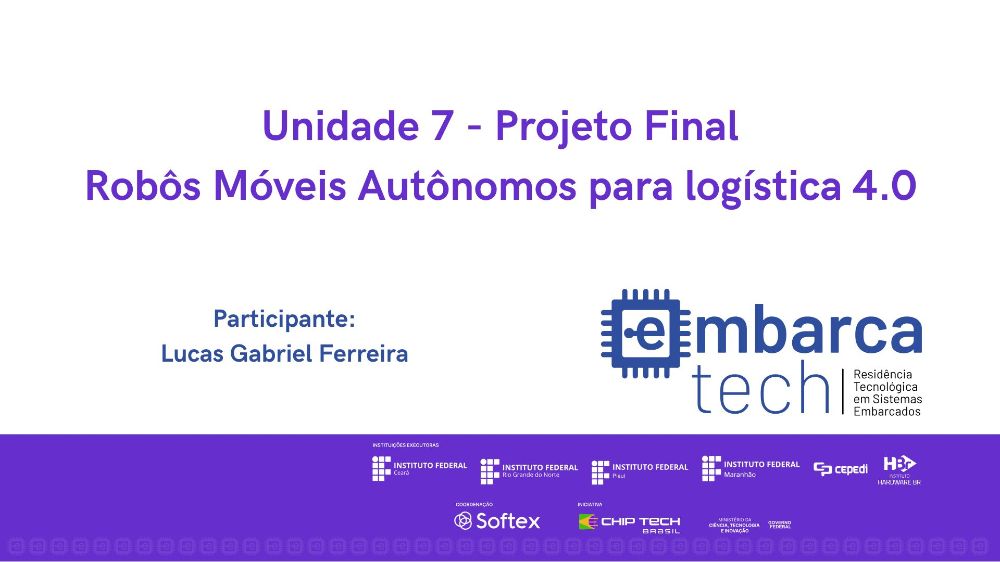

# EmbarcaTech_U7_Projeto.

  

## Projeto Final: Simulação de AMR para Logística 4.0

## Descrição do Projeto

Este projeto tem como objetivo simular o funcionamento de um AMR (Autonomous Mobile Robot) capaz de se mover em um pequeno cenário e transportar cargas. A indústria, principalmente a internacional, já possui soluções avançadas para esse tipo de problema, e construir uma versão simplificada proporciona uma melhor compreensão dessa tecnologia tão demandada atualmente.
Esse projeto é uma aplicação prática de conceitos de automação e robótica, permitindo capacitação nesse segmento, algo pouco comum na região do interior da Bahia. Dessa forma, abre-se a oportunidade para o desenvolvimento de tecnologias relevantes para o setor industrial.

## Componentes Utilizados

- **Joystick (ADC nos eixos X e Y)**: Captura dos valores analógicos de movimentação.
- **Microcontrolador Raspberry Pi Pico W (RP2040)**: Responsável pelo controle dos pinos GPIO.
- **LED RGB**: Com os pinos conectados às GPIOs 11, 12 e 13.
- **Botão A**: Conectado à GPIO 5.
- **Botão B**: Conectado à GPIO 6
- **Botão do Joystick**: Conectado à GPIO 22.
- **Display SSD1306**: Conectado via I2C nas GPIOs 14 e 15.
- **Matriz de LEDs WS2812B**: Conectada à GPIO 7.
- **Buzzer 1 e Buzzer 2**: Emitindo alertas sonoros, conectados às GPIOs 10 e 21.
- **Potenciômetro do Joystick**: Conectado às entradas analógicas GPIO 26 (eixo X) e GPIO 27 (eixo Y).

## Ambiente de Desenvolvimento

- **VS Code**: Ambiente de desenvolvimento utilizado para escrever e debugar o código.
- **Linguagem C**: Linguagem de programação utilizada no desenvolvimento do projeto.
- **Pico SDK**: Kit de Desenvolvimento de Software utilizado para programar a placa Raspberry Pi Pico W.
- **Simulador Wokwi**: Ferramenta de simulação utilizada para testar o projeto.

## Guia de Instalação

1. Clone o repositório:
2. Importe o projeto utilizando a extensão da Raspberry Pi.
3. Compile o código utilizando a extensão da Raspberry Pi.
4. Caso queira executar na placa BitDogLab, insira o UF2 na placa em modo bootsel.
5. Para a simulação, basta executar pela extensão no ambiente integrado do VSCode.

## Guia de Uso
O projeto possui três funcionalidades principais:

- **Movimentação Manual**:

  O AMR pode ser controlado por meio do joystick, permitindo que o usuário o direcione no ambiente de simulação.
  A posição do robô é representada graficamente em uma matriz de LEDs, onde:
    1. Vermelho: Representa o robô.
    2. Azul: Representa as paredes da fábrica.
    3. Verde: Indica as cargas a serem transportadas.
    4. Magenta: Indica o ponto de distribuição.
  
  O display auxiliar exibe:
    1. O setor da fábrica onde o robô está localizado.
    2. A capacidade atual de carga do robô.
    3. A quantidade de cargas ainda pendentes para transporte.
  
  Se o robô colidir com uma parede, um LED RGB e um buzzer fornecem um alerta sonoro e visual.

  Ao coletar ou entregar uma carga, um feedback luminoso e sonoro é acionado.

- **Navegação Automática**:

  O AMR é capaz de se movimentar de forma autônoma, sem a necessidade de controle pelo usuário.

  Algoritmos de Busca em Espaços de Estados e Capacitated Vehicle Routing Problem (CVRP) são utilizados para otimizar o trajeto do robô.

  O robô automaticamente coleta e transporta cargas até o ponto de distribuição de maneira eficiente.

- **Monitoramento do Sistema**:

  O display auxiliar fornece informações sobre o funcionamento do sistema em tempo real.
  Dados relevantes sobre o estado do robô e da simulação são atualizados dinamicamente.

## Testes

Testes básicos foram implementados para garantir que cada componente está funcionando corretamente, incluindo: 

  1. Leitura dos valores do joystick e resposta dos LEDs RGB.
  2. Verificação do correto acionamento dos buzzers.
  3. Renderização precisa da posição do robô no display e na matriz de LEDs.
  4. Execução da lógica de movimentação manual e automática.

## Desenvolvedor

[Lucas Gabriel Ferreira](https://github.com/usuario-lider)

## Vídeo da Solução

Clique na imagem abaixo para assistir ao vídeo que demonstra a solução trabalhada e os resultados obtidos nos experimentos:

  

